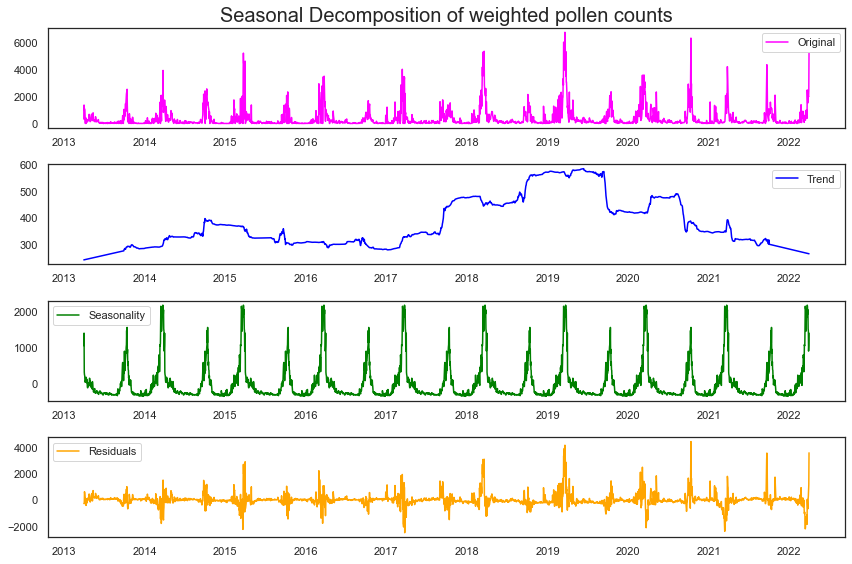

# Table Of Contents

### 1) Introduction

### 2) Business Problem

### 3) Data Understanding 

### 4) Data Exploration and Analysis

### 5) Classification Modeling
   - 5a Modeling Differenced Data
   - 5b Modeling Seasonally Decomposed Residuals
   - 5c Modeling weekly trends
   
### 6) Time series modeling and forecasting

### 7) Further Considerations with species analysis

### 8) Conclusion

### 9) References

### 10) Appendix

----

# *Houston, We Have an Allergy Problem:*
## Pollen Count Predictions for Allergies in Houston, Tx
### Nicholas Kennedy May, 2022

# 1) Introduction and Business Understanding 
Allergies are a impact lives  everywhere, but esepcially in Texas, US. Central texas is notorious for severe allergies, but in reality this problem affects the whole state. The surprising thing about this is that most of texas is a desert without much flora to speak of. Houston, however is uniquly positioned in texas being relatively near the desert, the ocean, marshland and forest. 

Allergy seasons occur with consistent regularity throughout the year. Spring and fall are universally known as the worst times of the year for allergies due to high pollen counts. It therefore stands to reason that using basic climate data, like wind speed, temperature and precipitation, seasonal in nature themselves, could be used to estimate and forecast pollen counts

Yet, while very possible, using weather and climate data to predict pollen counts is not particularly ground-breaking, because this data is also subject seasonal fluctuation. However, if seasonality is removed from the equation, does information such as local precipitation, temperature and wind speed still have an effect? 

# 2) Business Problem
The past 2 years, ravaged by the Covid-19 global pandemic, has made much of the world wary of the tiniest sniffle for fear they have contracted the highly infectious disease that has killed so many. Additionally the broad variety and severity of symptoms across the board has had many confuse their sympotons with allergies and vice versa, thus bringing a much greater attention to Allergies in general. 

Knowing when healthcare systems can expect more patient visits due to allergies can help brace not only providers for the impact of higher case-loads, but also pharmacies for medicine stocking. With the National Allergy Bureau and the CDC working with medical providers and pharmacies, these organizations can not only prepare these kinds of entities, but also help bring awareness and understanding to individual allergy-sufferers among the general population. 

Lastly, in the further considerations a collaberation between public health organizations, pharmacies and members of the public is proposed in order to develop an application that can compare allergy medication purchases with species specific pollen data to use as a diagnostic support tool in identifying people's individual allergens.

# 3) Data Understanding and Preparation

The data used in this report comes from two sources: 
- Pollen data comes from The <a href="https://www.houstontx.gov/health/Pollen-Mold/pollen-archives.html">Houston Health Department website</a>
- Climate data comes from the the <a href="ncei.noaa.gov"> National Oceanic and Atmospheric Administration's (NOAA) National Center for Environmental Information (NCEI) </a>

Pollen Data was compiled from individual monthly spreadsheets from 2013 to 2022 consisting of pollen counts measured in parts per cubic meter. It consists of species specific daily pollen counts collected throughout the month except on weekends and holidays. It also distinguishes between tree, grass and weed pollen. The data was collected by three different technicians. 

Climate data was obtained for three testing sites, 2 located in Houston (suffixed '18' and '60'), and one located in Shreveport, LA (suffixed S), roughly 200 miles away in a highly vegetated area in order to see if its climate has an impact on the airborne pollen levels in Houston. Climate data consists of daily precipitation `PRCP`, average temperature `TAVG` and average wind speed `AWND`. For Shreveport, fastest 2 minute wind speed `WFD2` was also included in an attempt to see if wind currents from the nearby city had any role in Houston's pollen problem. 

Pollen counts were weighted differently for grass, weed, and tree problem based off of their differing classifications for severity levels as explained by the <a href ="https://www.houstontx.gov/health/Pollen-Mold/numbers.html"> Houston Health Department </a>

these adjusted counts were then tallied into one variable, `pollen_weighted`, which itself was used to create 3 distinct classification for daily pollen intensity: `high`, `very_high` and `super_high`

3,372 days in total, just shy of 10 years comprise this time series data. 

The details of this data cleaning and preparation can be found <a href="https://github.com/nikennedy/pollen_forecasting/blob/main/Auxilliary%20Notebooks/Data%20Cleaning.ipynb"> here in another notebook in this repo</a>

# 4) Data Exploration
the bulk of preliminary data exploration can be found <a href='https://github.com/nikennedy/pollen_forecasting/blob/main/Auxilliary%20Notebooks/EDA.ipynb'> here in a separate notebook.</a> Below shows the highlights as well as the most pertinent findings for this report. 

For the purpose of modeling the individual species will be ignored for now and explored in "Further Considerations" Towards the end of the report.

The first step in exploratory data analysis was to see if the chosen variables seemed to affect the current or following year's pollen counts

We expected to see higher precipitation at least affect pollen counts in the following year due to increased or decreased plant growth, but if there is such a relationship it is not clear from these data. Below looks at precipitation from shreveport, and still nothing clear. 

See the notebook(s) for additional EDA

# 5) Modeling With Differenced and Decomposed Data
The modeling portion of this report consists of two parts: Pollen Level Classification and Time Series Forecasting. Given that all of the variables appear to have seasonality. The correlations shown so far are likely merely a consequence of that. Modeling seasonal pollen levels from seasonal variables should be straightforward to address

The next question this report first hopes to address is if, with all trends removed, can a classification model such as logistic regression with these variables outperform a dummy classifier. 

The next question, much simpler, relies on this seasonality to forecast pollen levels reliably for Houston. While this is not a classifiction model, the predicted pollen counts are the basis for the classification targets and thus can be applied directly. 

The forecasting could then be applied to the further considerations, where, as proof of concept, artificial customers and medication purchases are generated to show how species data can be used as a diagnostic tool for allergen identification.

## 5a) Modeling with Differenced Data
Differencing is the most popular technique for removing trends, seasonality, etc. and making a time-series stationary so the modeling starts there

With an accuracy of 60% and precision score of 59%, this is the best model for differenced data

# 5b) Modeling The Residuals of Seasonal Decomposition
in order to separate the seasonal component from the data, we try seasonal decomposition and isolate the residuals

### Seasonal Decomposition with statsmodels
given the high seasonlity of both target and variables, the first step is to remove that dependence from the data.

Having tried several models, the most success for this data again came from a Random Forest Classifier

It is still not proven that the improvement from the baseline is not caused by seasonality as even after decomposition the climate variables still appear to have seasonal patterns. Nevertheless this model by a slim margin is the best in terms of accuracy and precision, rounding these metrics still results in 60% and 59% respectively:

  This model has a RMSE of ~425, meaning on average, the predictions from last year's counts are off by 425 particles per cubic meter
  
  Using S/Arima we were able to produce a model that performed ok on Test data, with an RMSE of 591. Using Sarima, log-transformed weighted pollen counts proved more effective for training the model than raw pollen counts. 
  
  
# 7) Further Considerations
## A. Species Analysis
An Additional goal of this report, intended primarily for further research is a comprehensive breakdown of plant (and eventually mold) species. The goal being to work with pharmacies and customers to match days of purchase and usage of allergy medications to spikes in pollen counts. This could be used a diagnostic support tool for allergy-type identification. 

Data for allergy purposes is primarily available to research institutions via an application, however random data could be generated to be distributed more frequently around days of high pollen counts. These artificial consumer purchases throughout the decade could be matched by date to species-specific pollen counts to be used as a diagnostic tool. Many people do not have easy access to allergists, often due to financial constraints or scarcity of providers. Offering an alternative that aids the public in understanding the causes of their symptoms can empower individuals to take control of and learn about their allergies. This would potentially mitigate the upswing in doctor visits that occurs in allergy season, providing relief to over-extended medical facilities during the Covid-19 era.

Future work will provide the framework for an easy to use app that let's the public match their medication purchases to species' pollen counts and help them better understand the causes of their allergies and prepare to address their symptoms

## B. Improving Modeling

Pollen counts are the result of complex floral and atmospheric conditions not only locally but around the country. Pollen can remain in still air for up to 11 hours. Wind patterns make it so pollen can travel as much as 400 miles, decreasing logarithmically with distance. Other factors such humidity and species-specific growing conditions can also play a large role. Including more variables and incorporating the time-series element (seasonality) will only improve the model's accuracy. Adding climate data from more locations in and around Houston and using Principle Component Analysis (PCA) to reduce dimensionality and multicolinearity are also proposed and next steps.

## C. Investigating Mold Spore Counts
Pollen is only one cause of seasonal allergies. The Houston Health Department also has species-specific airborne mold spore counts which can be modeled like pollen and used to create a more robust classification of bad allergy days. 

## D. Improving High Pollen Criteria and incorporating multiple classes of severity
By refining the pollen count determination of `high` vs not high pollen days as well as modeling days of `very_high` and `super_high` pollen days would allow for better understanding of the effects and timing of allergies in the general public

# 8 Conclusion
Modeling a complex natural phenomenon like airborne pollen counts depends on a number of factors outside of basic local climate data like average temperature, average wind speed, and precipitation. While it's possible that these variables do indeed influcence daily pollen counts locally, it's also more than likely that it is their own seasonal patterns that allow for accurate modeling. Divorcing these variables and pollen counts from their seasonal components may not provide much insight into allergy severity. 

Due to the high levels of multicolinearity and seasonality of all of the data, Classifiers than ignore multicolinearity proved the most successful, with a K-Nearest-Neighbors model marginally outperforming the Random Forest Classifier model for best fit. 

Time Series modeling was possible for upsampled weekly data. It offered an accurate prediction of pollen counts as long as seasonality was incorporated. Log-transofrmed pollen counts produced better modeling results in terms of error. Different metrics of AIC and RMSE were not always consistent, with low-value AIC models sometimes resulting in higher RMSE. Out of the S/ARIMA type models, the first Arima model with an p,d,q order of (2,0,1) and seasonal order (0,1,1,52) performed best on the test data.  However, the best fit for test data predictions actually came from the previous year's counts, which predicted the test data with the least amount of error

Given the similarity in symptoms, bringing awareness and understanding to allergies is especially important in the post-Covid era as healthcare systems were taxed to their breaking points. Helping the public better understand the timing and causes of their sniffles and sneezes not only helps individuals, but also the medical providers that treat them.

# 10) Additional References

1) https://www.chpa.org/sites/default/files/media/docs/2020-10/Assessing-Consumer-Benefits-of-Allergy-Rx-OTC-Switches-03012017.pdf

2) https://www.ochsner.org/services/allergy-asthma-and-immunology/pollen-mold

